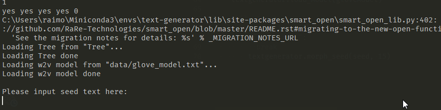

BladeSupernova's text generator
===

This work was done in cooperation with [@bladedsupernova](https://github.com/bladedsupernova), who actually did most of the ideation and initial work.

This text generator is meant to be another approach to achieve a text generator that is white-boxed. This is, that the whole process of text generation can be easily understood and interpreted without obscure models.

As such, this is an algorithmic approach to the generation of relationships between words/concepts that this generator can exploit.

---

Setting up your environment:
---

```console
./setup.sh
```

This script will

- Download external dependencies required (Wiki 100K most frequent words, GloVe.6B pre-trained model and an initial text corpora).
- Create a conda environment with Python 3.6 and the needed dependencies for the project (conda 4.6+ required)
- Activate the environment
- Transform the GloVe model into a Word2Vec representation the system can use

Running it:
---

```console
./run.sh
```



Enter an empty string as input to finish text generation.

Running tests:
---

```console
./test.sh
```

---

Concept:
---

(Yet to be revised and improved on.)

The idea behind this approach is to keep a tree of words/phrases that relate to one another. Then, a seed will activate an initial node that will decide, between the most possible tokens to complete the sentence.

Up to here, the behavior is exactly the same as any simple text predictor: it looks at the previous words and selects the most common next word based on the ones before.

### Word vectors

However, this approach will also consider words that are in a similar word-space from the GloVe model. This means that possible words will also include words/phrases that have not been directly observed in the original data set, but have been inferred from the vector relationships.

As an example, the GloVe word vectors will have a similar position for the words `cat` and `dog`, since both are mostly used in similar contexts.

If the dataset then shows that `the cat jumps` is a very common phrase, a seed like `the dog` could very well yield `the dog jumps`, even if that combination has never been seen before.

### "Energy leaking"

Most text generators will include a concept of attention that tries to select/forget vectors from the previous activations so that they can preserve some context of the text while predicting new tokens. This is a very expensive operation because it requires an attention mechanism that will relate _m_ generated tokens to each possible new _n_  tokens. Usually, text generators will impose a limit to _m_ and _n_, limiting the attention mechanism based on compute capacity limits.

In this approach, as words keep getting selected, they keep gaining weight in the original tree, were activations and selections of words keep getting considered for them. This replaces the attention mechanism by keeping one single context that can be used across each of the tokens. The "forgetting" of tokens never really happens, but rather, as they get very few activations, they will be forgotten by having very low weights in the tree.

## Glossary of concepts

(Pending.)